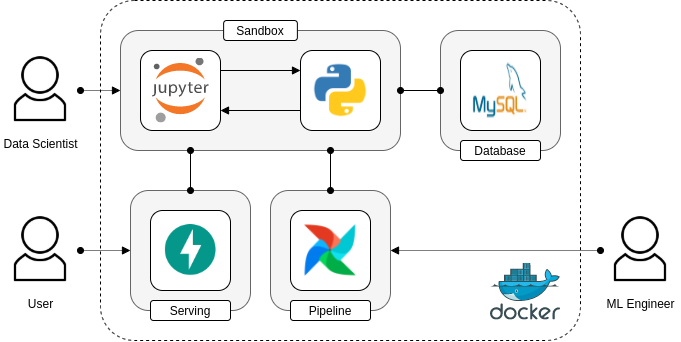

# iFood MLOps App

> This repository is the documentation of my solution for the iFood ML Engineer test.

## 1. Getting Started

### 1.1. Introduction

The iFood MLOps App is a ML platform built on top of Docker designed to help data scientists to develop and deploy ML 
models. It is composed by four main components tied together by a Python SDK: 

 - **Sandbox**: Jupyter based env to develop, train, test and deploy models;
 - **Pipeline**: Apache Airflow based pipeline to train, test and deploy models;
 - **Database**: MySQL based database to register ML experiments and predictions;
 - **Serving**: FastAPI based api to serve predictions.
 
The ML platform dynamics is best understood with [this](/sandbox/workspace/iris.ipynb) example notebook that will be
available at runtime.

### 1.2. Pre-requisites

Install [Docker](https://docs.docker.com/get-docker/) (v1.13.0+) and [Docker Compose](https://docs.docker.com/compose/install/) (v1.10.0+).

### 2. Architecture

<p align="center"></p>

### 2.1. Applications

| App          | Address                                            | Description                                                    |
| ------------ | -------------------------------------------------- | -------------------------------------------------------------- |
| Sandbox      | [localhost:8888](http://localhost:8888/)           | Jupyter based env to develop, train, test and deploy models    |
| Pipeline     | [localhost:8080](http://localhost:8080/)           | Apache Airflow based pipeline to train, test and deploy models |
| Database     | [localhost:3306](http://localhost:3306/)           | MySQL based database to register ML experiments                |
| Serving API  | [localhost:8000](http://localhost:8000/)           | FastAPI based api to serve models predictions and predictions  |
| Serving Docs | [localhost:8000/docs](http://localhost:8000/docs/) | Swagger based web docs for serving api 

### 2.2. Description

For a further description of each application, please checkout [docs](docs/Apps.md).

## 3. Build

### 3.1. Local build

You can build the project locally.

> **Note**: Local build is currently only supported on Linux OS distributions.

```bash
./build.sh
```

### 3.2. Remote build (recommended)

Alternatively, you can use the images pre-built on [DockerHub](https://hub.docker.com/u/andreper). The images are built
with GitHub actions, you can check the code [here](.github/workflows).

## 4. Run

### 4.1. Run local build

If you build the project locally, you can start the platform with the following command:

```bash
docker-compose -f docker-compose-local.yml up
```

### 4.2. Run remote build (recommended)

If you prefer to use the pre-built images, start the platform by running the following command:

```bash
docker-compose up
```
